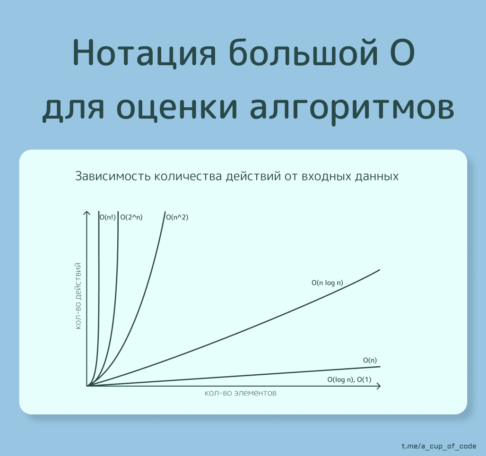

# Нотация большой О (Big O Notation)

[Кратко в посте ->](https://t.me/a_cup_of_code/84)

Чаще всего для измерения эффективности алгоритма используется Нотация Большой О (Big O Notation) и записывается как $O(n)$, то есть большая О и какой-то показатель n.

## Что такое $O(n)$?

Это математическое описание сложности алгоритма, при котором используется алгебраические обозначения.

Пример: 
Запись $O(n²)$ читается как "О от n в квадрате" или "О(большая) в квадрате". Буква n в этом примере представляет из себя размер полученных данных. Для их обработки алгоритму со асимптотической сложностью $O(n²)$ потребуется совершить количество действий, равное длине входных данных в квадрате. Пример алгоритма с такой сложностью  —  сортировка выбором.

Нотация большой О оценивает верхную границу сложности и оценивает алгоритм абстрактно. Таким образом запись $O(n^2)$ значит, что алгоритм будет потреблять времени(совершать действий), **не более чем**, квадратично относительно размера входных данных.

## Зачем нам это нужно?

Представим, что мы разрабатываем игру Судоку. Каждый раз, когда пользователь ввел число, необходимо проверить, что число не встречается в ряду, столбце и подквадрате. 

Общий размер входных данных, при максимально заполненном судоку,  равен 81 числу (9 * 9). Мы бы могли написать несколько алгоритмов, запустить их с замерами скорости и сравнить время выполнения. Но проверить "в вакууме" мы всё равно не сможем, и время выполнения будет отличаться при каждом запуске. Кроме того на время выполнения повлияет и "железо" устройства на котором мы запустим программу. Более мощный компьютер выполнит алгоритм быстрее. Нам необходимо абстрактное измерение, которое не будет зависить от устройства. Поэтому мы и воспользуемся оценкой асимптотической сложности, где будем измерять "условные" действия. Вообще "абстрактная оценка" используется очень часто, к примеру в планировании проекта мы используем **story points** величины непривязанные напрямую к конкретным значениям.

Разберём самые популярные сложности алгоритмов:

$O(1)$ - при реализации константной сложности у нас всегда будет одинаковое количество действий, даже если бы судоку была 100 на 100 ячеек  
$O(log n)$ - логарифмическая сложность означает значительное сокращение при увеличении. Судоку 9 * 9 будет требовать 6 действий *(логарифм 81 по основанию 2 равен 6.33)*, а судоку 100 на 100 потребует всего 13 действий  
$O(n)$ - линейная сложность напрямую зависит от размера входных данных. Для судоку 9 * 9 нужно 81 действие, 100 на 100 требует 10_000 действий  
$O(n²)$ - квадратичная сложность означает значительное увеличение количества операций относительно входных данных. Так судоку 9 * 9 будет требовать 6561 операцию, а 100 * 100 требует 100 милиона действий!  

На илюстрации ниже мы можем заметить рост графиков. Если при малых входных данных(кол-во элементов) сложность алгоритма влияет слабо на скорость выполенения(кол-во действий), то при их росте графики меняются значительно. 

При `n = 1` и `n^2` и `!n` и просто `1` будут равны одному и тому же значению, но при `n = 10` или даже `n = 100` раличия будут заметны.

{width=50% height=50% title="График роста сложности"} 
> график роста сложности в нотации О большая

## Заключение
В итоге, при логарифмической сложности пользователь вряд-ли заметит время на расчёты, даже если его судоку будет размеров 100 на 100 (как 11 судоку в ряд и 11 в высоту). Но если наш алгоритм будет неоптимальным, квадратичным или даже хуже, то вероятно пользователь не дождётся проверки судоку.

💬 А вот моё [решение](https://by-lazarev.github.io/Mastering_Algorithms/arrays/valid_sudoku/) судоку
